# Devin System Architecture Diagrams

> Generated: 2026-03-26
> Format: Mermaid (renders on GitHub)

---

## 1. Session Pipeline Flow

The core session chain showing how work items flow through the system.

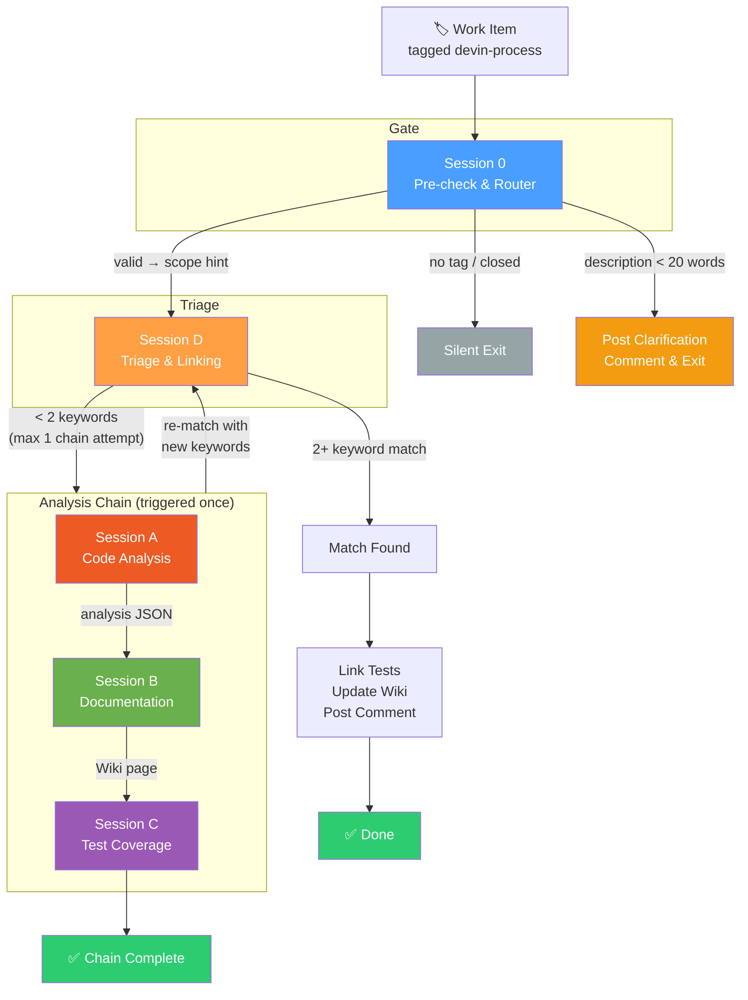

---

## 2. All Sessions Overview

Every session in the system with their relationships.

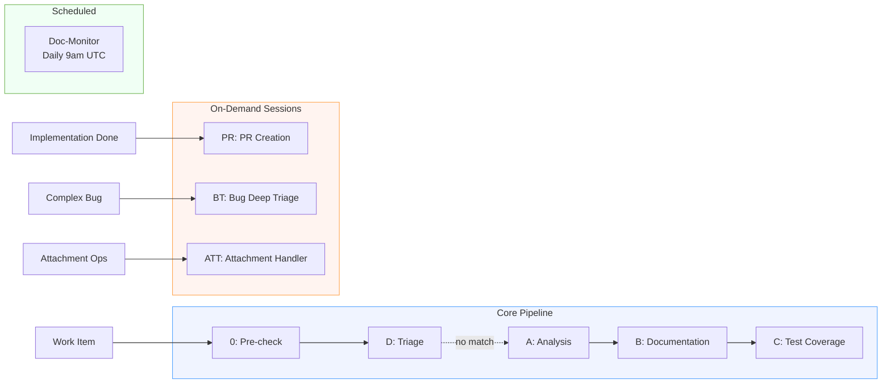

---

## 3. Artifact Data Flow

How data moves between sessions through persistent artifacts.

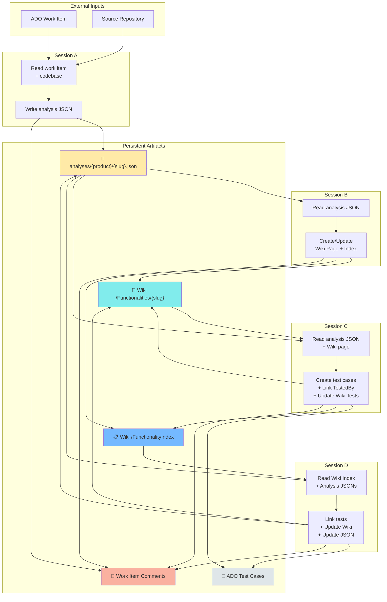

---

## 4. Script Library Map

All 28 ADO scripts organized by domain.

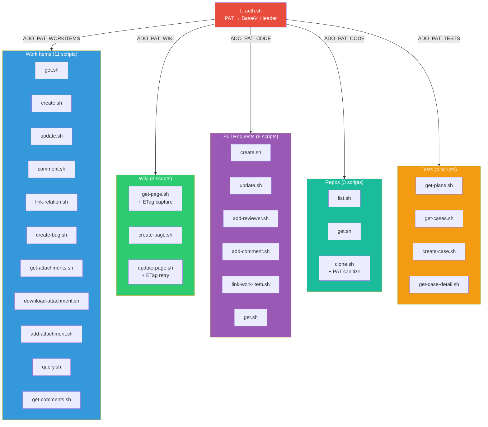

---

## 5. Session → Script Usage Matrix

Which sessions use which script domains.

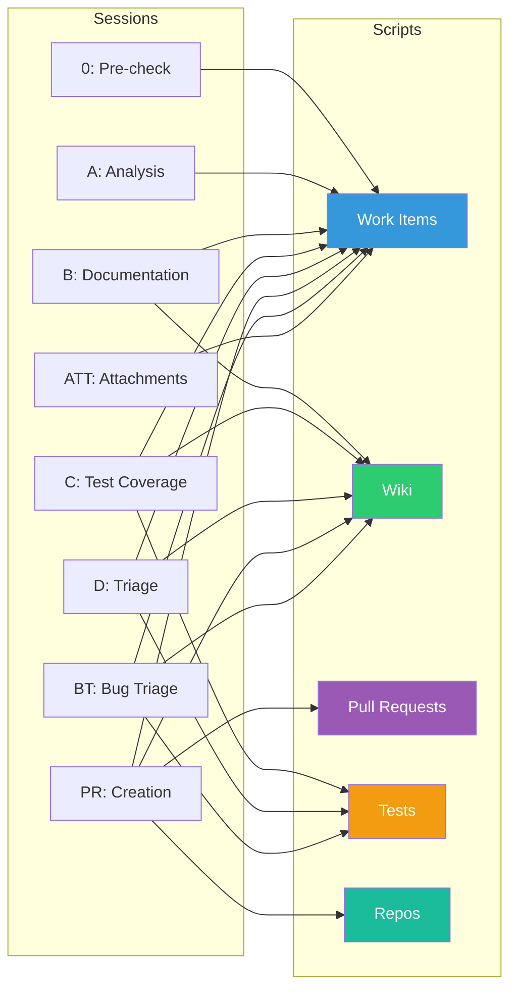

---

## 6. Knowledge Items & Trigger Map

How knowledge items map to script domains and sessions.

```mermaid
flowchart TD
    subgraph Knowledge["Knowledge Items (12)"]
        K_AUTH["ado-auth<br/><i>PAT, Base64, scopes</i>"]
        K_WI["ado-work-items<br/><i>Fields, JSON Patch, relations</i>"]
        K_WIKI["ado-wiki<br/><i>ETag, page CRUD</i>"]
        K_PR["ado-pull-requests<br/><i>Create, reviewers, merge</i>"]
        K_TEST["ado-tests<br/><i>Cases as work items, XML</i>"]
        K_ERR["ado-error-handling<br/><i>HTTP status, recovery</i>"]
        K_ATTACH["ado-attachments<br/><i>2-step upload</i>"]
        K_QUERY["ado-queries<br/><i>WIQL syntax</i>"]
        K_REPO["ado-repos<br/><i>ID lookup, clone URL</i>"]
        K_PRC["ado-pr-comments<br/><i>Thread model, inline</i>"]
        K_ENV["environment<br/><i>Org URL, PAT scopes</i>"]
        K_KW["keyword-extraction<br/><i>Triage algorithm</i>"]
    end

    subgraph Domains["Script Domains"]
        D_WI["work-items/ (11)"]
        D_WIKI["wiki/ (3)"]
        D_PR["pull-requests/ (6)"]
        D_TEST["tests/ (4)"]
        D_REPO["repos/ (3)"]
    end

    K_AUTH --> D_WI & D_WIKI & D_PR & D_TEST & D_REPO
    K_WI --> D_WI
    K_WIKI --> D_WIKI
    K_PR --> D_PR
    K_TEST --> D_TEST
    K_ATTACH --> D_WI
    K_QUERY --> D_WI
    K_REPO --> D_REPO
    K_PRC --> D_PR
    K_ERR -.->|"all domains"| D_WI & D_WIKI & D_PR & D_TEST & D_REPO
    K_ENV -.->|"all domains"| D_WI & D_WIKI & D_PR & D_TEST & D_REPO

    style Knowledge fill:#fff3e0
    style Domains fill:#e3f2fd
```

---

## 7. Output Schema Flow

Which sessions produce which artifacts using which schema definitions.

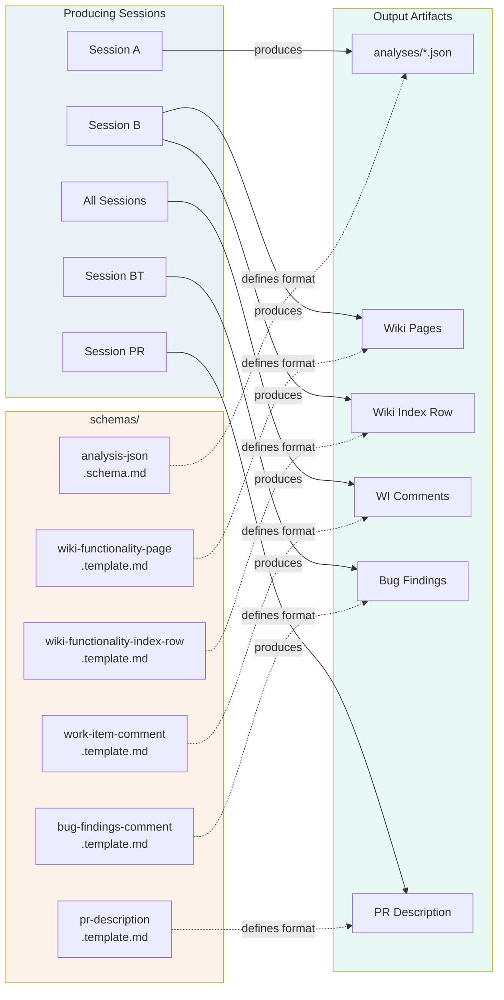

---

## 8. PAT Security Model

How credentials are compartmentalized across operations.

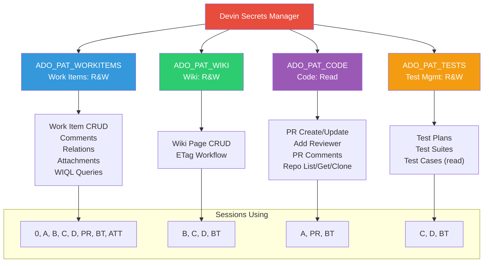

---

## 9. Documentation Structure

The complete repository file organization.

```mermaid
flowchart TD
    ROOT["📁 Devin Repo"]

    ROOT --> DEVIN["📁 devin/"]
    ROOT --> SCRIPTS["📁 scripts/ado/"]
    ROOT --> STORAGE["📁 DevinStorage/"]
    ROOT --> SCHEMAS["📁 schemas/"]
    ROOT --> DOCS["📁 docs/"]

    DEVIN --> K["📁 knowledge/ (12 items)"]
    DEVIN --> P["📁 playbooks/ (9 sessions)"]
    DEVIN --> SEC["📁 secrets/"]

    SCRIPTS --> S_WI["📁 work-items/ (11)"]
    SCRIPTS --> S_WIKI["📁 wiki/ (3)"]
    SCRIPTS --> S_PR["📁 pull-requests/ (6)"]
    SCRIPTS --> S_TEST["📁 tests/ (4)"]
    SCRIPTS --> S_REPO["📁 repos/ (3)"]
    SCRIPTS --> S_AUTH["🔑 auth.sh"]

    STORAGE --> DD["📁 Devin Documentation/<br/>15 files: best practices,<br/>guides, references"]
    STORAGE --> AD["📁 AzureDevOps Documentation/<br/>18 files: API guides,<br/>operations, references"]
    STORAGE --> SCHED["📁 schedules/<br/>doc-monitor-state.json"]

    SCHEMAS --> S1["analysis-json.schema.md"]
    SCHEMAS --> S2["wiki-*.template.md (2)"]
    SCHEMAS --> S3["*-comment.template.md (2)"]
    SCHEMAS --> S4["pr-description.template.md"]

    DOCS --> D1["ado-api-reference.md"]
    DOCS --> D2["ado-operation-reference.md"]
    DOCS --> D3["error-catalog.md"]
    DOCS --> D4["field-reference.md"]
    DOCS --> D5["changelog.md"]

    style ROOT fill:#2c3e50,color:#fff
    style DEVIN fill:#3498db,color:#fff
    style SCRIPTS fill:#e74c3c,color:#fff
    style STORAGE fill:#2ecc71,color:#fff
    style SCHEMAS fill:#f39c12,color:#fff
    style DOCS fill:#9b59b6,color:#fff
```

---

## 10. ETag Workflow (Wiki Updates)

The critical ETag concurrency pattern used by Sessions B, C, and D.

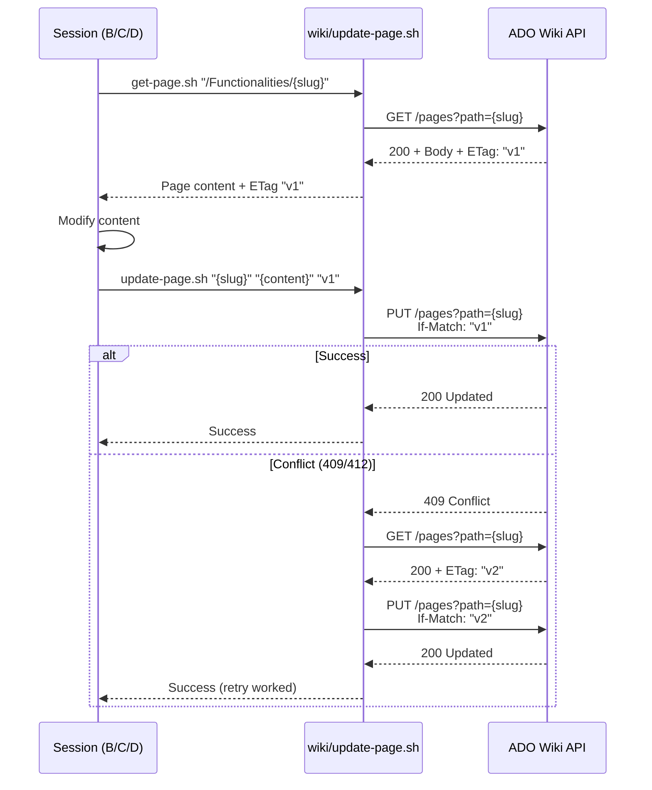

---

## 11. Attachment Upload (2-Step Process)

The commonly misunderstood attachment upload workflow.

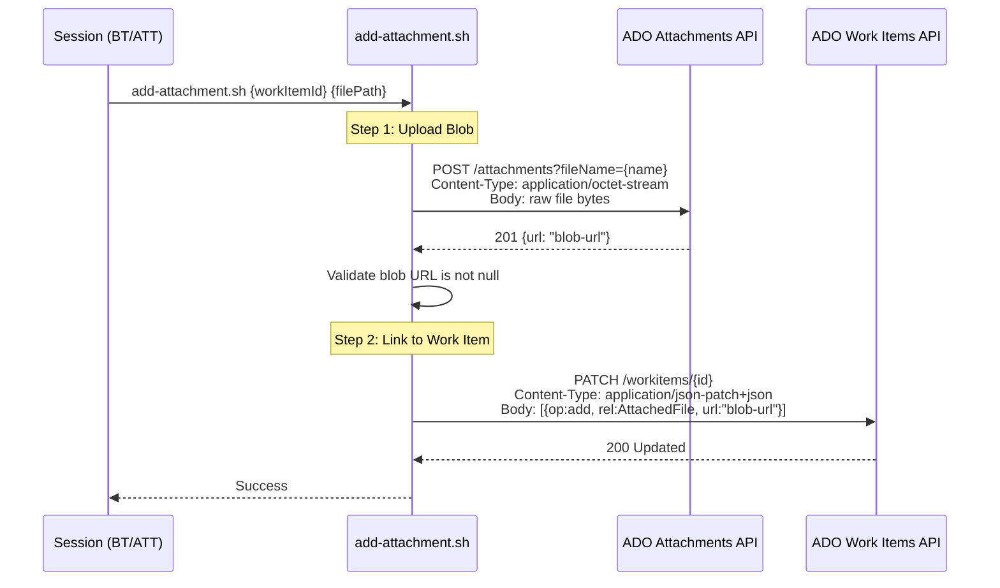

---

## 12. Session D Decision Logic

The triage matching algorithm with loop guard.

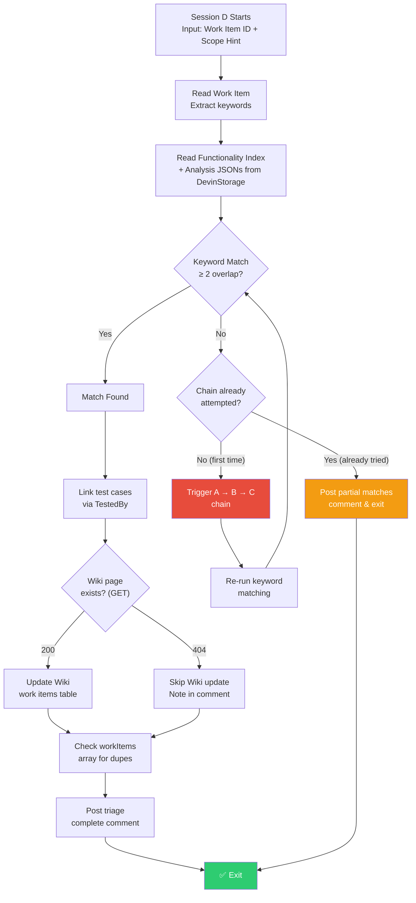
